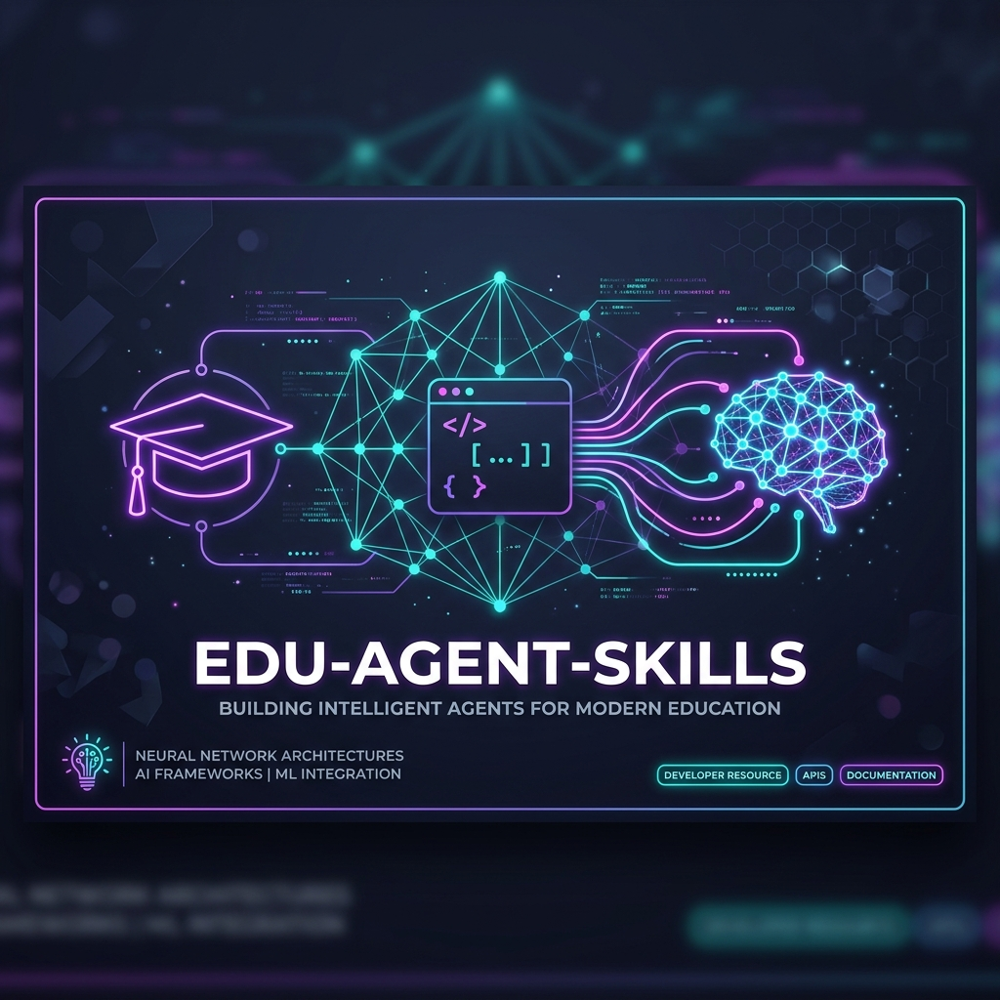

<p align="center">
  
</p>

<p align="center">
  <a href="https://www.npmjs.com/package/edu-agent-skills"></a>
  <a href="LICENSE"></a>
  
  
  <a href="CONTRIBUTING.md"></a>
</p>

---

# 🎓 edu-agent-skills

> **Turn your standard, code-dumping AI coding agents into elite technical mentors, adaptive teachers, and debugging coaches.**

Most AI coding assistants are built to do the work *for* you. They dump solutions, fix bugs silently, and reinforce passive copying. `edu-agent-skills` changes that. 

This repository provides **20 standardized, plug-and-play educational skill specifications** that inject rigorous, active-learning pedagogy directly into your favorite coding agents (Gemini CLI, Claude Code, Cursor, and more) with a single command.

---

## 🎯 Who is this for?

Whether you are a developer looking to upskill, an educator scaling personalized instruction, or an agent builder, `edu-agent-skills` is designed to fit your workflow:

| User Profile | How It Helps You |
| :--- | :--- |
| **🧑‍💻 Learners & Self-Taught Devs** | **Prevent AI "codewriting dependency."** Instead of having the AI copy-paste code, learn system architectures, debug workflows, and build core comprehension with an AI tutor that explains, quizzes, and guides you. |
| **🎓 Educators & Bootcamps** | **Scale high-quality active pedagogy.** Standardize how AI learning companions orient students, diagnose prerequisite gaps, evaluate understanding, and coach project implementation inside your course repositories. |
| **🛠️ AI Agent & Tool Builders** | **Embed state-of-the-art teaching behaviors out of the box.** Integrate modular, vendor-neutral skill profiles that work seamlessly in Gemini CLI, Claude Code, Cursor, and custom agent runtimes without hardcoding orchestration logic. |

---

## 🚀 Quick Start

Inject all 20 skills into your detected agent runtimes with just one command:

```bash
# Auto-detect your local agents and install all skills
npx edu-agent-skills install
```

### Or target a specific agent:

```bash
# Target Gemini CLI
npx edu-agent-skills install --agent gemini

# Target Claude Code
npx edu-agent-skills install --agent claude
```

> **How it works:** Under the hood, the CLI detects your installed tools and places the standardized skill specifications where the agents can automatically load and activate them. The skills activate dynamically when your agent encounters relevant learning contexts!

---

## 🛠️ CLI Usage

Take complete control over your educational environment using the built-in CLI:

```bash
# List all available skills and categories
npx edu-agent-skills list

# Show detailed documentation, metadata, and status of a specific skill
npx edu-agent-skills info teach-concept

# Detect compatible agents installed on your local machine
npx edu-agent-skills detect

# Install only specific selected skills
npx edu-agent-skills install --skills teach-concept,debug-teacher

# Install into current project directory scope instead of globally
npx edu-agent-skills install --scope project

# Target a completely custom folder directory
npx edu-agent-skills install --target ./my-agent/skills

# Uninstall skills from a target agent
npx edu-agent-skills remove --agent gemini
```

---

## 📚 Available Skills (20)

The repository organizes educational competencies into **6 cognitive categories** that compose together to guide learners from first-contact onboarding to production-grade project delivery.

| Category | Skills | Description |
| :--- | :--- | :--- |
| **🧭 Onboarding** | `repo-understand`, `find-your-level`, `lesson-plan` | Profile the learner's level, map curriculum paths, and orient them before teaching. |
| **📖 Teaching** | `teach-concept`, `socratic-mode`, `deep-dive`, `simplify-topic` | Deliver rich concepts, simplify complex topics, and escalate to guided Socratic questioning. |
| **📝 Assessment** | `check-understanding`, `challenge-generator`, `interview-mode`, `misconception-detector` | Explicitly verify learning, generate coding challenges, run mock interviews, and isolate bugs in understanding. |
| **🧠 Memory** | `learning-memory`, `weak-area-tracker` | Track progress across learning sessions and maintain continuity on weak areas. |
| **⚡ Productivity** | `flashcards`, `revision-mode`, `spaced-repetition` | Maximize knowledge retention using flashcard generation and spaced revision schedules. |
| **🏗️ Projects** | `build-with-me`, `architecture-review`, `debug-teacher`, `project-review` | Pair program interactively, review architectures, teach debugging logic, and assess project submissions. |

👉 For full descriptions, composition rules, and workflow mechanics, check out [skills/INDEX.md](skills/INDEX.md).

---

## 🔌 Supported Agents

We support leading agent ecosystems out-of-the-box, with manual options for custom setups:

| Agent Runtimes | Detection Status | Global Skill Installation Location |
| :--- | :---: | :--- |
| **Gemini CLI** | Auto-Detected `✓` | `~/.gemini/skills/` |
| **Claude Code** | Auto-Detected `✓` | `~/.claude/skills/` |
| **Cursor** | Auto-Detected `✓` | `~/.cursor/skills/` |
| **OpenAI Codex** | Auto-Detected `✓` | `~/.codex/skills/` |
| **Custom Setup** | Manual Target `—` | Specify any custom directory using `--target` |

---

## 🧠 Core Philosophy

Our pedagogy is grounded in five core educational principles defined in [AGENTS.md](AGENTS.md):

*   **Active recall** over passive reading (quiz early, quiz often).
*   **Socratic prompting** over instant answers (help learners find the answer themselves).
*   **Curriculum sequencing** over random topic jumping (check prerequisites first).
*   **Misconception analysis** over silent bug-fixing (diagnose *why* they had a bug).
*   **Project-based practice** over abstract memorization (write real code to learn real concepts).

---

## 📐 Skill Architecture & Standards

Every skill is designed to be highly portable, vendor-neutral, and easily parsed. Standardized under [docs/skill-standard.md](docs/skill-standard.md), each skill contains:
1.  **`SKILL.md`**: Declares YAML frontmatter (name, authors, tags), activation logic, step-by-step workflow, and guardrails.
2.  **`examples.md`**: Provides high-fidelity realistic dialogue walkthroughs and anti-patterns.

To understand how multiple skills compose dynamically, see [docs/skill-composition.md](docs/skill-composition.md).

---

## 🤝 Contributing

We welcome educational skills, testing rubrics, and platform integrations from the community!

*   Check out our [CONTRIBUTING.md](CONTRIBUTING.md) to get started.
*   Read [docs/skill-standard.md](docs/skill-standard.md) to understand the quality bar.
*   Use our [templates/skill-template/SKILL.md](templates/skill-template/SKILL.md) to draft your new skill.
*   Learn how drafts graduate to stable releases in [docs/promotion-criteria.md](docs/promotion-criteria.md).

---

## 📄 License

Distributed under the MIT License. See [LICENSE](LICENSE) for more details.
